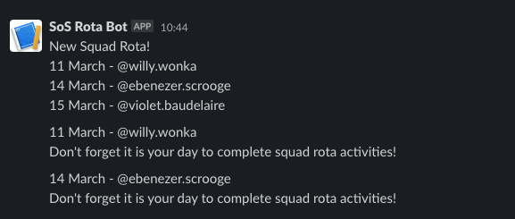

# slack-rota
Daily Rota for Organising Teams via a Slack Bot. Every working day (ignoring UK bank holidays and weekends)
the rota will alert the squad and tag the user who's day it is to complete the activities. Once the rota is
finished a new one will be generated with all of the names, in a random order each time.

## Setup

### Requirements

1. Python 3
2. Python `holidays` and `requests` modules
3. Task scheduler such as `cron`
4. Slack bot added to workspace

### Creating the slack bot

1. Ensure you're logged into Slack on the web browser and then go to [https://api.slack.com/apps?new_app=1](the slackbot config).
2. Click `Create New App` -> `From Scratch` -> Give it a name (slack rota for example) and add to the company workplace.
3. If your company requires apps to be approved by admins then you now need to wait for them to verify it.
4. On the create app page, you should now see your app. Click on it to open the app settings.
5. On the left hand side navigation menu go to `Incoming Webhooks`.
6. Active incoming webhooks
7. At the bottom click `Add New Webhook to Workspace`
8. Search for the channel you want to add it to.
9. Back on the webhooks page you should see a list of all the channels you've added this bot to. Each will have a URL which is the URL we need to send the data to, to get the slack bot to post the message. (You can see on the example cURL that you simply make a HTTP POST request to the specific endpoint, and send the data to the bot.)

> The URL is of the shape `https://hooks.slack.com/services/X/Y/Z`, we need the `X/Y/Z` for the script to work

### Installing

1. Make sure you have created the slack bot from the previous section and have the `X/Y/Z` for the channel you want to add the integration to.
2. Clone to repo to a system with a task scheduler. We then need to add two files, `names.txt` and `slack_integration_code.txt`
3. `names.txt` should be a *newline* delimited list of names that we want to add to the rota. If you add their slack usernames (for example `@charlie.chaplin`) then they'll be tagged in the slack message which is a good reminder for them to complete their activities.
4. `slack_integration_code.txt` should be a single line that contains the `X/Y/Z` formatted webhook URL. For example, the file could be `T02GEFU92/B02K5DH4TP0/heYdbHUvDstIwooR0jxY4KKm`

> `names.txt` and `slack_integration_code.txt` should be at the same directory level as the python script

Then we need a way of scheduling this script to run every day. I used `cron` to accomplish this for me, but set it up however you wish.

If you are using `cron` then I did the following steps.
1. `$ crontab -e` to open the crontab editor.
2. Add in the following entry `0 6 * * * cd /path/to/slack_rota/ && ./slack_rota.py`.
3. Save and quit the file, which should update the `cron` scheduler.

> The example `cron` command will run the script every day at 6:00. You could change the time from 6 to another time without issue. Currently the script expects to be run once per day so you'll run into issues if you set a schedule more or less than once a day.

### Multi Squad Setup

The script itself can only handle one squad, though there is a trivial workaround to get it to work for multiple squads. First you must clone the repo somewhere on the filesystem as normal. Then for each squad:

1. Add the slack bot webook for the new squad and get the webhook integration code.
2. Create a directory for the squad `$ mkdir my-fav-squad`.
3. Symlink the python script into the new directory `$ ln -s /path/to/slack_rota/slack_rota.py /path/to/my-fav-squad/slack_rota.py`.
4. Fill out `slack_integration_code.txt` and `names.txt` in the `my-fav-squad` directory.
5. Setup the scheduling, for example add a cron job `0 6 * * * cd /path/to/my-fav-squad/ && ./slack_rota.py`.

> You can repeat this for all of the squads you need, obviously you'd just use different directories to `my-fav-squad`.

## Limitations

This script was fairly speedily thrown together so there is fairly limited functionality. It would be good to improve these in the future

### Multi Squad Setup

While there is a decent workaround using the filesystem it would be good to allow the script to natively support multiple squads. Perhaps a JSON file could be used as the config rather than `names.txt` and that could have an entry for each squad.

### Tasks of Other Time Lengths

The script is built just to inform about some kind of daily task that a member of the squad needs to complete. However there may be tasks that only need doing in the squad once per week. It would be good in future to perhaps use the JOSN file from above to have a setting for how often we need the task to be ran (perhaps once per week).

### Slack Messages

Currently the messages which are sent to be displayed in Slack are just hard coded (except the dynamic insertion of the name and date). It could be cool to have optional messages so the alert can be more descriptive of what work needs completing as part of the rota task. Potentially we could use the same JSON file, or pass through command line arguments.

### Bank Holidays

The script skips running on a weekend (assuming we only work weekdays) and it also uses the python `holidays` module to skip bank holidays. Since I live the UK I have it set to skip UK holidays. However, this could be improved by making it more generic.

Additionally, there is an issue where the `holidays` module contains entries which are not actually bank holidays, or there are issues with some dates from some of the UK countries in the others. For example `St Andrews Day` activated a skip of the script, which is incorrect behaviour.

### Testing

I have only done manual testing, it could be good to have unit tests added.
